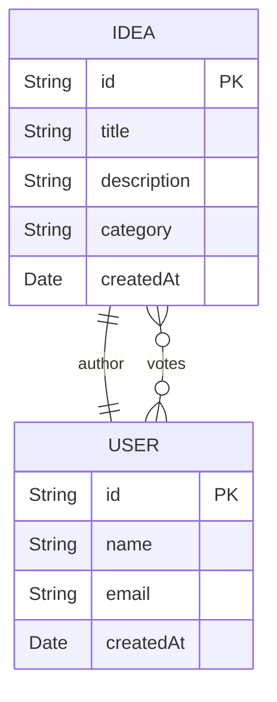

# Project IDEAS

Aplicação web para compartilhar ideias com votos, construída em Node.js e Express.  
Usa MongoDB via Mongoose, templates Handlebars e sessões armazenadas no MongoDB.

### Instalação e Execução

Siga os passos para preparar ambiente, instalar dependências e iniciar o servidor.

1. Pré-requisitos:
   - Node.js 18+ e npm
   - MongoDB em execução
2. Clone o repositório:
   ```bash
   git clone https://github.com/HeitorCarvalhoCampos/Projeto-Async.git
   cd Projeto-Async
   ```
3. Instale as dependências:
   ```bash
   npm install
   ```
4. Configure variáveis de ambiente criando um arquivo .env:
   ```bash
   # .env
   MONGO_URI=mongodb://localhost:27017/projeto-ideias
   SESSION_SECRET=segredo_super_seguro
   PORT=3000
   ```
5. Inicie a aplicação:
   ```bash
   npm run dev
   # ou
   npm start
   ```
6. Acesse no navegador:
   - http://localhost:3000

# Conexão com o Banco de Dados

Este módulo estabelece a conexão com o MongoDB usando Mongoose e variáveis de ambiente.  
Ele encerra o processo em caso de falha, garantindo que a aplicação não inicie sem acesso ao banco.

```js
// db/conn.js
const mongoose = require('mongoose');
require('dotenv').config();

const connectDB = async () => {
  try {
    await mongoose.connect(process.env.MONGO_URI, {
      useNewUrlParser: true,
      useUnifiedTopology: true,
    });
    console.log('MongoDB conectado com sucesso!');
  } catch (err) {
    console.error('Erro ao conectar no MongoDB:', err.message);
    process.exit(1);
  }
};

module.exports = connectDB;
```


# Modelos de Dados

## models/User.js

Define o esquema de usuários, com hash de senha automático e verificação de credenciais.

- **Campos**  
  - `name`: String, obrigatório  
  - `email`: String, único, lowercase, trimmed  
  - `password`: String, obrigatório  
  - `createdAt`: Date, default agora  

- **Hooks & Métodos**  
  1. `pre('save')`: hashea a senha com bcrypt antes de salvar  
  2. `checkPassword(password)`: compara senha em texto plano com hash  

```js
// models/User.js
const mongoose = require('mongoose');
const bcrypt = require('bcrypt');

const userSchema = new mongoose.Schema({
  name:      { type: String, required: true },
  email:     { type: String, required: true, unique: true, lowercase: true, trim: true },
  password:  { type: String, required: true },
  createdAt: { type: Date,   default: Date.now }
});

userSchema.pre('save', async function(next) {
  if (!this.isModified('password')) return next();
  this.password = await bcrypt.hash(this.password, 10);
  next();
});

userSchema.methods.checkPassword = function(password) {
  return bcrypt.compare(password, this.password);
};

module.exports = mongoose.models.User || mongoose.model('User', userSchema);
```

## models/Idea.js

Representa ideias propostas por usuários, com sistema de votos e categoria.

- **Campos**  
  - `title`: String, obrigatório  
  - `description`: String, obrigatório  
  - `category`: String, obrigatório  
  - `authorId`: ObjectId (User), obrigatório  
  - `votes`: [ObjectId (User)]  
  - `createdAt`: Date, default agora  

- **Virtuals**  
  - `voteCount`: número de votos (tamanho do array `votes`)

```js
// models/Idea.js
const mongoose = require('mongoose');

const ideaSchema = new mongoose.Schema({
  title:       { type: String, required: true },
  description: { type: String, required: true },
  category:    { type: String, required: true },
  authorId:    { type: mongoose.Schema.Types.ObjectId, ref: 'User', required: true },
  votes:       [{ type: mongoose.Schema.Types.ObjectId, ref: 'User' }],
  createdAt:   { type: Date, default: Date.now }
}, {
  toJSON:   { virtuals: true },
  toObject: { virtuals: true }
});

ideaSchema.virtual('voteCount').get(function() {
  return this.votes.length;
});

module.exports = mongoose.models.Idea || mongoose.model('Idea', ideaSchema);
```





# Helpers e Middlewares

## helpers/auth.js

Garante que rotas só sejam acessíveis por usuários autenticados via Passport.

- `ensureAuthenticated(req, res, next)`: redireciona para `/users/login` se não autenticado.

```js
// helpers/auth.js
module.exports = {
  ensureAuthenticated(req, res, next) {
    if (req.isAuthenticated()) return next();
    req.flash('error_msg', 'Por favor, faça login para continuar.');
    res.redirect('/users/login');
  }
};
```

## middlewares/authMiddleware.js

Verifica sessão customizada (sem Passport).

- `isLoggedIn(req, res, next)`: exige `req.session.user`, caso contrário redireciona para login.

```js
// middlewares/authMiddleware.js
module.exports = {
  isLoggedIn(req, res, next) {
    if (!req.session.user) {
      req.flash('error', 'Você precisa estar logado para acessar esta página');
      return res.redirect('/users/login');
    }
    next();
  }
};
```

## middlewares/authorMiddleware.js

Protege edição/exclusão de ideias, garantindo que só o autor possa modificar.

- `isAuthor(req, res, next)`: compara `idea.authorId` com `req.session.user._id`.

```js
// middlewares/authorMiddleware.js
const Idea = require('../models/Idea');

module.exports = {
  async isAuthor(req, res, next) {
    const idea = await Idea.findById(req.params.id);
    if (!idea || idea.authorId.toString() !== req.session.user._id.toString()) {
      req.flash('error', 'Você não tem permissão para editar esta ideia');
      return res.redirect('/ideas');
    }
    next();
  }
};
```


# Controladores (Controllers)

## controllers/UserController.js

Gerencia autenticação e perfil de usuário.

- **registerPage**: exibe formulário de registro  
- **register**: cria novo usuário; valida e-mail único  
- **loginPage**: exibe formulário de login  
- **login**: autentica usuário; valida senha  
- **logout**: encerra sessão  
- **profilePage**: lista ideias do usuário no perfil  

```js
// controllers/UserController.js
const User = require('../models/User');
const Idea = require('../models/Idea');

class UserController {
  static registerPage(req, res) { /* ... */ }
  static async register(req, res) { /* ... */ }
  static loginPage(req, res) { /* ... */ }
  static async login(req, res) { /* ... */ }
  static logout(req, res) { /* ... */ }
  static async profilePage(req, res) { /* ... */ }
}

module.exports = UserController;
```

### APIs de Usuário

```api
{
  "title": "Registrar Usuário",
  "description": "Cria um novo usuário",
  "method": "POST",
  "baseUrl": "http://localhost:3000",
  "endpoint": "/users/register",
  "bodyType": "form",
  "formData": [
    { "key": "name", "value": "Nome completo", "required": true },
    { "key": "email", "value": "E-mail válido", "required": true },
    { "key": "password", "value": "Senha", "required": true }
  ],
  "responses": {
    "201": { "description": "Usuário criado" },
    "400": { "description": "E-mail já cadastrado" },
    "500": { "description": "Erro interno" }
  }
}
```

```api
{
  "title": "Login de Usuário",
  "description": "Autentica e gera sessão",
  "method": "POST",
  "baseUrl": "http://localhost:3000",
  "endpoint": "/users/login",
  "bodyType": "form",
  "formData": [
    { "key": "email", "value": "E-mail cadastrado", "required": true },
    { "key": "password", "value": "Senha", "required": true }
  ],
  "responses": {
    "200": { "description": "Login bem-sucedido" },
    "401": { "description": "Credenciais inválidas" },
    "500": { "description": "Erro interno" }
  }
}
```

```api
{
  "title": "Logout de Usuário",
  "description": "Encerra sessão",
  "method": "GET",
  "baseUrl": "http://localhost:3000",
  "endpoint": "/users/logout",
  "bodyType": "none",
  "responses": {
    "302": { "description": "Redireciona para login" }
  }
}
```

```api
{
  "title": "Perfil do Usuário",
  "description": "Retorna usuário e ideias próprias",
  "method": "GET",
  "baseUrl": "http://localhost:3000",
  "endpoint": "/users/profile",
  "headers": [{ "key": "Cookie", "value": "session=...", "required": true }],
  "bodyType": "none",
  "responses": {
    "200": { "description": "Página de perfil" },
    "302": { "description": "Redireciona para login" }
  }
}
```


## controllers/IdeaController.js

Responsável pelas operações CRUD de ideias.

- **list**: lista todas as ideias ordenadas por votos  
- **createPage**: exibe formulário de criação  
- **create**: persiste nova ideia  
- **details**: exibe detalhes de uma ideia  
- **editPage**: exibe formulário de edição  
- **update**: atualiza campos de ideia  
- **delete**: remove ideia  

```js
// controllers/IdeaController.js
const Idea = require('../models/Idea');

class IdeaController {
  static async list(req, res) { /* ... */ }
  static createPage(req, res) { /* ... */ }
  static async create(req, res) { /* ... */ }
  static async details(req, res) { /* ... */ }
  static async editPage(req, res) { /* ... */ }
  static async update(req, res) { /* ... */ }
  static async delete(req, res) { /* ... */ }
}

module.exports = IdeaController;
```

### APIs de Ideias

```api
{
  "title": "Listar Ideias",
  "description": "Retorna lista de todas as ideias",
  "method": "GET",
  "baseUrl": "http://localhost:3000",
  "endpoint": "/ideas",
  "headers": [{ "key": "Cookie", "value": "session=...", "required": true }],
  "responses": {
    "200": { "description": "Lista de ideias" },
    "500": { "description": "Erro interno" }
  }
}
```

```api
{
  "title": "Formulário de Criação de Ideia",
  "description": "Exibe página para criar ideia",
  "method": "GET",
  "baseUrl": "http://localhost:3000",
  "endpoint": "/ideas/create",
  "headers": [{ "key": "Cookie", "value": "session=...", "required": true }],
  "responses": {
    "200": { "description": "Formulário de criação" }
  }
}
```

```api
{
  "title": "Criar Ideia",
  "description": "Persistir nova ideia",
  "method": "POST",
  "baseUrl": "http://localhost:3000",
  "endpoint": "/ideas/create",
  "bodyType": "form",
  "formData": [
    { "key": "title",       "value": "Título da ideia",    "required": true },
    { "key": "description", "value": "Descrição detalhada",  "required": true },
    { "key": "category",    "value": "Categoria da ideia",   "required": true }
  ],
  "responses": {
    "201": { "description": "Ideia criada" },
    "500": { "description": "Erro interno" }
  }
}
```

```api
{
  "title": "Detalhes de Ideia",
  "description": "Retorna dados de uma ideia",
  "method": "GET",
  "baseUrl": "http://localhost:3000",
  "endpoint": "/ideas/:id",
  "pathParams": [
    { "key": "id", "value": "ID da ideia", "required": true }
  ],
  "responses": {
    "200": { "description": "Detalhes da ideia" },
    "404": { "description": "Ideia não encontrada" },
    "500": { "description": "Erro interno" }
  }
}
```

```api
{
  "title": "Formulário de Edição de Ideia",
  "description": "Exibe página para editar ideia",
  "method": "GET",
  "baseUrl": "http://localhost:3000",
  "endpoint": "/ideas/edit/:id",
  "pathParams": [
    { "key": "id", "value": "ID da ideia", "required": true }
  ],
  "responses": {
    "200": { "description": "Formulário de edição" },
    "302": { "description": "Redireciona se não autorizado" }
  }
}
```

```api
{
  "title": "Atualizar Ideia",
  "description": "Salva alterações em uma ideia",
  "method": "POST",
  "baseUrl": "http://localhost:3000",
  "endpoint": "/ideas/edit/:id",
  "pathParams": [
    { "key": "id", "value": "ID da ideia", "required": true }
  ],
  "bodyType": "form",
  "formData": [
    { "key": "title",       "value": "Título atualizado",    "required": true },
    { "key": "description", "value": "Descrição atualizada",  "required": true },
    { "key": "category",    "value": "Categoria atualizada",   "required": true }
  ],
  "responses": {
    "200": { "description": "Ideia atualizada" },
    "500": { "description": "Erro interno" }
  }
}
```

```api
{
  "title": "Deletar Ideia",
  "description": "Remove uma ideia existente",
  "method": "POST",
  "baseUrl": "http://localhost:3000",
  "endpoint": "/ideas/delete/:id",
  "pathParams": [
    { "key": "id", "value": "ID da ideia", "required": true }
  ],
  "responses": {
    "200": { "description": "Ideia removida" },
    "500": { "description": "Erro interno" }
  }
}
```


## controllers/VoteController.js

Alterna voto do usuário em uma ideia (adiciona ou remove).

```js
// controllers/VoteController.js
const Idea = require('../models/Idea');

class VoteController {
  static async toggleVote(req, res) { /* ... */ }
}

module.exports = VoteController;
```

### API de Votos

```api
{
  "title": "Votar/Desvotar Ideia",
  "description": "Registra ou remove voto de usuário",
  "method": "POST",
  "baseUrl": "http://localhost:3000",
  "endpoint": "/votes/:id",
  "pathParams": [
    { "key": "id", "value": "ID da ideia", "required": true }
  ],
  "headers": [{ "key": "Cookie", "value": "session=...", "required": true }],
  "responses": {
    "200": { "description": "Voto atualizado" },
    "404": { "description": "Ideia não encontrada" },
    "500": { "description": "Erro interno" }
  }
}
```


# Definição de Rotas

## routes/userRoutes.js

Liga endpoints de usuário ao `UserController` e middleware de sessão.

```js
const express = require('express');
const router = express.Router();
const UserController = require('../controllers/UserController');
const { isLoggedIn } = require('../middlewares/authMiddleware');

router.get('/register', UserController.registerPage);
router.post('/register', UserController.register);
router.get('/login',    UserController.loginPage);
router.post('/login',   UserController.login);
router.get('/logout',   UserController.logout);
router.get('/profile',  isLoggedIn, UserController.profilePage);

module.exports = router;
```

## routes/ideaRoutes.js

Encadeia segurança (login/autor) e ações de ideias.

```js
const express = require('express');
const router = express.Router();
const IdeaController = require('../controllers/IdeaController');
const { isLoggedIn } = require('../middlewares/authMiddleware');
const { isAuthor }   = require('../middlewares/authorMiddleware');

router.get('/',            isLoggedIn, IdeaController.list);
router.get('/create',      isLoggedIn, IdeaController.createPage);
router.post('/create',     isLoggedIn, IdeaController.create);
router.get('/edit/:id',    isLoggedIn, isAuthor, IdeaController.editPage);
router.post('/edit/:id',   isLoggedIn, isAuthor, IdeaController.update);
router.post('/delete/:id', isLoggedIn, isAuthor, IdeaController.delete);
router.get('/:id',         IdeaController.details);

module.exports = router;
```

## routes/voteRoutes.js

Rota única para votação.

```js
const express = require('express');
const router = express.Router();
const VoteController = require('../controllers/VoteController');
const { isLoggedIn } = require('../middlewares/authMiddleware');

router.post('/:id', isLoggedIn, VoteController.toggleVote);

module.exports = router;
```


# Templates de Visão (Handlebars)

## Layout Principal

- **main.handlebars**  
  Define `<head>`, `<nav>`, container de conteúdo e `<footer>`.

```html
<!DOCTYPE html>
<html lang="pt-br">
<head> … </head>
<body>
  {{> navbar }}
  <div class="container py-5">
    {{> messages }}
    {{{ body }}}
  </div>
  <footer> … </footer>
  <script src="…bootstrap.bundle.min.js"></script>
</body>
</html>
```

## Partials

| Arquivo                        | Descrição                         |
| ------------------------------ | --------------------------------- |
| views/partials/navbar.handlebars   | Barra de navegação com links      |
| views/partials/messages.handlebars | Exibe flash messages (sucesso/erro)|

## Páginas Genéricas

- **home.handlebars**: tela de boas-vindas ou redireciona para lista de ideias  
- **404.handlebars**: página não encontrada  

## Usuário

- **login.handlebars**: formulário de login  
- **register.handlebars**: formulário de cadastro  
- **profile.handlebars**: exibe dados do usuário e lista de ideias próprias  

## Ideias

- **list.handlebars**: mostra cards de todas as ideias com voto interativo  
- **create.handlebars**: formulário para criar nova ideia  
- **details.handlebars**: detalhes da ideia, botões de voto, editar/excluir para autor  
- **edit.handlebars**: formulário para atualizar ideia existente  


# Configuração da Aplicação

## app.js

Configura servidor Express, middlewares e rotas principais.

- Conexão com MongoDB  
- Segurança básica (Helmet)  
- Sessão armazenada no MongoDB (connect-mongo)  
- Flash messages  
- Configuração do Handlebars (helpers `eq` e `formatDate`)  
- Rotas: `/users`, `/ideas`, `/votes`, `/` (home), fallback 404  

```js
// app.js
const express = require('express');
const exphbs  = require('express-handlebars');
const session = require('express-session');
const flash   = require('express-flash');
const helmet  = require('helmet');
const MongoStore = require('connect-mongo');
const connectDB  = require('./db/conn');

require('dotenv').config();
connectDB();

const app = express();
app.use(helmet({ contentSecurityPolicy: false }));
app.use(session({ /* ...MongoStore...*/ }));
app.use(flash());
app.use(express.urlencoded({ extended: true }));
app.use(express.json());
app.use(express.static('public'));

// Handlebars
app.engine('handlebars', exphbs.engine({ defaultLayout: 'main', helpers: { eq:…, formatDate:… } }));
app.set('view engine', 'handlebars');
app.set('views', 'views');

// Rotas
app.use('/users',  require('./routes/userRoutes'));
app.use('/ideas',  require('./routes/ideaRoutes'));
app.use('/votes',  require('./routes/voteRoutes'));
app.get('/',       require('./controllers/IdeaController').list);
app.use((req,res) => res.status(404).render('404', {layout:'main', title:'Página não encontrada'}));

module.exports = app;
```

## index.js

Ponto de entrada: define porta e inicializa servidor.

```js
// index.js
require('dotenv').config();
const app = require('./app');
const PORT = process.env.PORT || 3000;

app.listen(PORT, () => console.log(`Servidor rodando na porta ${PORT}`));
```

## package.json

Gerencia scripts e dependências principais.

| Script      | Comando                    |
| ----------- | ---------------------------|
| start       | node index.js             |
| dev         | nodemon index.js          |

| Dependência        | Versão      | Uso                                               |
| ------------------ | ----------- | ------------------------------------------------- |
| bcrypt             | ^6.0.0      | Hash de senhas                                    |
| connect-mongo      | ^5.1.0      | Armazenamento de sessão no MongoDB                |
| dotenv             | ^17.2.3     | Variáveis de ambiente                             |
| express            | ^5.1.0      | Framework HTTP                                    |
| express-handlebars | ^8.0.3      | Motor de templates                                |
| express-session    | ^1.18.2     | Gerenciamento de sessão                           |
| express-flash      | ^0.0.2      | Flash messages                                    |
| helmet             | ^8.1.0      | Segurança de cabeçalhos HTTP                      |
| mongoose           | ^8.19.2     | ODM para MongoDB                                  |

```json
{
  "name": "projeto-ideias",
  "version": "1.0.0",
  "main": "index.js",
  "scripts": {
    "start": "node index.js",
    "dev": "nodemon index.js"
  },
  "dependencies": {
    "bcrypt": "^6.0.0",
    "connect-mongo": "^5.1.0",
    "dotenv": "^17.2.3",
    "express": "^5.1.0",
    "express-flash": "^0.0.2",
    "express-handlebars": "^8.0.3",
    "express-session": "^1.18.2",
    "helmet": "^8.1.0",
    "mongoose": "^8.19.2"
  }
}
```

# Modelagem do Banco de Dados


